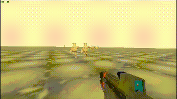

# WHAT

A Demonstration on my style of creating first person character controllers which also contains
simple enemy AI which can chase the player 

# HOW

Prerequisites :  
		> Godot Mono Version 4.0 and above. - I wrote the scripts entirely in Csharp , no gdscript. 
		> Dotnet installation. (version 6 of dotnet or higher). 
		> A vulkan enabled Graphics driver. I recommend using linux if you use intel integrated graphics which do not support vulkan on windows as the official driver release OS. 
		In linux , your integrated graphics driver mostly has vulkan enabled because its most likely implemented by the open source community [thanks open source mesa drivers] 

# SCREENSHOTS

